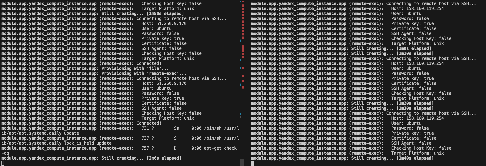

# pmg-inversion_infra
pmg-inversion Infra repository

## ДЗ - 3
### Знакомство с облачной инфраструктурой Yandex.Cloud

### Виртуальные машины
> local machine -> bastion -> someinternalhost

```
bastion_IP = 51.250.8.213
someinternalhost_IP = 10.128.0.7
```

### Подключение к `someinternalhost` в одну строку
***(через промежуточный bastion)***

`ssh -t -i ~/.ssh/appuser -A appuser@51.250.8.213 ssh appuser@10.128.0.7`

### Подключение к someinternalhost командой `ssh someinternalhost`
***(через промежуточный bastion)***

В файле `~/.ssh/config` добавить:
```
Host bastion
    HostName 51.250.8.213
    User appuser
    IdentityFile ~/.ssh/appuser

Host someinternalhost
    HostName 10.128.0.7
    User appuser
    IdentityFile ~/.ssh/appuser
    ProxyCommand ssh bastion nc %h %p
```

> Кстати, на бастион после такой настройки заходить также: `ssh bastion`

### VPN сервер
**Pritunl**
Веб-морда:
https://51.250.8.213/#/dashboard

Процесс настройки:
1. организация
2. пользователь
3. сервер

> После конфигурирования VPN сервера скачивается файл *.ovpn из веб морды.

Теперь подключение к внутреннему серверу с локальной машины возможен напрямую:
`ssh -i ~/.ssh/appuser appuser@10.128.0.7`

> Также, теперь можно добавить в `~/.ssh/config` следующие строчки:
> ```
> Host someinternalhost_vpn
>    HostName 10.128.0.7
>    User appuser
>    IdentityFile ~/.ssh/appuser
> ```
> и тогда подключение после поднятого vpn возможно напрямую:
> `ssh someinternalhost_vpn`
> *Отличие такого способа от описанного выше варианта заключается в том, что мы не указываем `ProxyCommand` в настройках ssh – данную функцию уже берёт на себя поднятое vpn подключение*

 ***Сейчас веб-интерфейс VPN-сервера Pritunl работает с самоподписанным сертификатом. И браузер постоянно ругается на это.***

 Решить эту проблему можно при помощи сервиса nip.io:
 Добавить домен вида `51-250-8-213.nip.io`

 ### Состав файлов задания
```
 /vpn/cloud-bastion.ovpn
 /vpn/setupvpn.sh
 /vpn/ssh-config   # конфиг из ~/.ssh/config
```

## ДЗ - 4
### Деплой тестового приложения

#### Виртуальные машины
> local machine -> testapp

#### Основное задание
```
testapp_IP = 130.193.39.107
testapp_port = 9292
```

#### Дополнительное задание
> В качестве доп. задания используйте созданные ранее скрипты для создания `startup script`, который будет запускаться при создании инстанса.

Реализовано два варианта:
- Запуск на основе последовательных shell скриптов: `create-instance-by-shell.sh`
- Запуск на основе декларативного указания пакетов: `create-instance-by-package.sh`

## ДЗ - 5
### Сборка образов VM при помощи Packer

#### Развертывание образа
http://158.160.5.85:9292

#### Построение bake-образа
`immutable.json` и вся его обвязка

## ДЗ - 6
### Практика IaC с использованием Terraform

#### Что сделано
Папка `terraform`:
- Подключен ресурс YC
- Определены и установлены input переменные
- Определены output переменные
- (рубрика "костыли") При развертывании `files/deploy.sh` проблемы с аптом (последовательный процесс происходит в многопоточный, в результате небольшой уроборос происходит с блокировками), поэтому к нему в запуск добавлен файл `files/clear_locks.sh`, который эти проблемы устраняет
- ключ для прохода теста положен в папку keys_example

#### Задание со *
- файл lb.tf с балансировщиком
- попробовал ручное заведение нескольких инстансов (`reddit-app2`)
- main.tf с возможностью создания нескольких инстансов через count.
  - ручное создание одинаковых инстансов само по себе фу, а ещё если надо много нод, то смысла в этом нет, если это можно одним параметром делать, а также использовать циклы для перебора нод (например в оутпут файлах)
- outputs.tf - сделан вывод:
  - external_ip_address_app - список внешних ip инстансов приложения
  - internal_ip_address_app - список внутренних ip инстансов приложения
  - external_ip_address_lb  - внешний ip адрес балансера


## ДЗ - 7
### Принципы организации инфраструктурного кода и работа над инфраструктурой в команде на примере Terraform.

#### Что сделано
Папка `terraform`:
- Разведено по модулям
- Разведено по stage и prod
```
> yc compute instance list
+----------------------+------------------+---------------+---------+-----------------+-------------+
|          ID          |       NAME       |    ZONE ID    | STATUS  |   EXTERNAL IP   | INTERNAL IP |
+----------------------+------------------+---------------+---------+-----------------+-------------+
| fhm2aseudmkat4v1s7of | stage-reddit-db  | ru-central1-a | RUNNING | 158.160.113.80  | 10.128.0.16 |
| fhmmft59n4almu195ou0 | stage-reddit-app | ru-central1-a | RUNNING | 158.160.119.254 | 10.128.0.7  |
| fhmob7qnk8cc36e5r7o3 | prod-reddit-app  | ru-central1-a | RUNNING | 51.250.9.170    | 10.128.0.8  |
| fhmoeojjvphhpuvm9t9e | prod-reddit-db   | ru-central1-a | RUNNING | 51.250.2.172    | 10.128.0.20 |
+----------------------+------------------+---------------+---------+-----------------+-------------+
```
- Из основной папки вычещены конфигурационные файлы

#### Задание со *
- создан s3 бакет pmg-tf-bucket
- создан backend.tf для работы с хранилищем
  - для передачи чувствительных параметров создан backend.conf (он в .gitignore) - в качестве примера приведён backend.conf.example
- запущен terraform в обеих директориях
  - созданы стейты в хранилище
```
> alias ycs3='aws s3 --endpoint-url=https://storage.yandexcloud.net'
> ycs3 ls
2024-01-21 15:07:02 pmg-tf-bucket
> ycs3 ls --recursive s3://pmg-tf-bucket
2024-01-22 16:39:20       8444 prod.tfstate
2024-01-22 16:39:37       8456 stage.tfstate
```
  - при одновременном запуске конфигураций блокировок не было
    - 
- необходимые provisioner лежат в папках модулей `.../app/files` и `.../db/files`
  - если требуется отключать provisioner через переменную, то лучший вариант, который нашёлся, – это передача параметра внутрь shell скрипта/файла с обработкой его значения через "if .. fi"

## ДЗ - 8
### Управление конфигурацией. Основные DevOps инструменты. Знакомство с Ansible.

#### Что сделано
Установлен клиент ansible
Папка `ansible`:
- Настройки
  - requirements.txt
  - ansible.cfg
    - Введён дополнительный параметр: python_interpreter, чтобы указывать нужную версию python для исполнения
- Файл inventory для управления хостом
- Файл inventory.yml – оно же, но в yaml формате
- Файл clone.yml – автоматизация дополнительных команд для playbook
  - Выполнение команды после команды `ansible app -m command -a 'rm -rf ~/reddit'` показывает изменения
    - Состав изменений
      - changed: [appserver]
      - appserver: changed=1
    - Причина в декларативном подходе описания инфраструктуры: возвращение к состоянию, описанному в инвентори (а ручное удаление директории, входящей в scope playbook, требует изменение состояния ноды app сервера)
- см. "Задание со *"

#### Задание со *
- Создан inventory.py, который создаёт динамический inventory.json
  - Динамическое определение реализуется за счёт класса TerraformUtils
    - В выбранном окружении (prod или stage) исполняется команда `terraform output -json`, результаты которой подставляются в inventory.json
    - inventory.py написан с возможностью лёгкого расширения списка различных параметров и расширения функционала, json формируется динамически, в завиимости от используемого списка модулей

## ДЗ - 9
### Деплой и управление конфигурацией с Ansible

#### Что сделано
- Плейбук для одного запуска
- Многозапусковывй плейбук
- Создание интеграция с packer как на стороне ansible, так и на стороне packer
- Создание отдельных файлов-плейбуков с объединением в один общий (`site.yml`)
